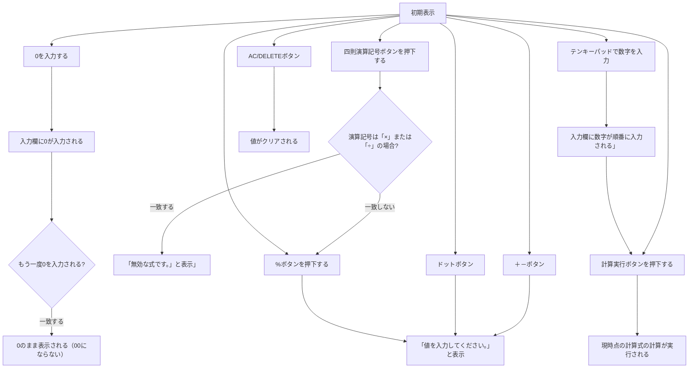

# 基本設計書

## 目次
0. [はじめに](#0-はじめに)  
1. [機能概要](#1-機能概要)  
　1.1 [利用環境](#11-利用環境)  
　1.2 [利用ユーザ/規模](#12-利用ユーザ規模)  
2. [システム概要](#2-システム概要)  
　2.1 [プロジェクト設計](#21-プロジェクト設計)  
3. [標準機能](#3-標準機能)  
4. [画面設計](#4-画面設計)  
5. [詳細](#5-詳細)  
　5.1 [四則演算](#51-四則演算)  
　　5.1.1 [加法](#511-加法)  
　　5.1.2 [減法](#512-減法)  
　　5.1.3 [乗法](#513-乗法)  
　　5.1.4 [除法](#514-除法)  
　5.2 [小数点計算](#52-小数点計算)  
　　5.2.1 [整数で割り切れない値の計算](#521-整数で割り切れない値の計算)  
　5.3 [負数計算](#53-負数計算)  
　　5.3.1 [0以下の数域の計算](#531-0以下の数域の計算)  
　5.4 [百分率計算](#54-百分率計算)  
　5.5 [正負（せいふ）切替機能](#55-正負せいふ切替機能)  
　5.6 [計算履歴](#56-計算履歴)  
6. [バリデーションチェック](#6-バリデーションチェック)  

## 0. はじめに
本書では電子式卓上計算機の基本機能、画面のレイアウト設計および入出力設計について記載する。

## 1. 機能概要
### 1.1 利用環境 
Google Chrome等のブラウザ上

### 1.2 利用ユーザ/規模
計算機能を電卓で行いたい全世代/1人利用

## 2. システム概要
### 2.1 プロジェクト設計
　OS:Windows10以上  
　JAVA：openJDK 17  
　Webコンテナ:tomcat9  
　開発ツール：VisualStudioCodeまたはEclipse2025以上
 
## 3. 標準機能
| 機能名 | 概要 | 備考 |
|:------------|:------------|:------------|
| 四則演算 | 加法、減法、乗法、除法の計算 |  |
| 小数点計算 | 整数で割り切れない値の計算 | 「.」（少数）が値に含まれる |
| 負数計算 | 0以下の数域の計算 | 負数は「－」（マイナス）の符号で表す |
| 百分率計算 | もととなる数を百に等しく分けて、その比率を計算 | 「％」（パーセント）の単位で表す |
| 正負（せいふ）切替機能 | 入力した値の符号を切り替える機能 | 「＋」（プラス）と「－」（マイナス） |
| 計算履歴| 入力した計算の履歴を表示する機能 | デフォルトは非表示 |

## 4. 画面設計
画面レイアウトは以下ソースを参照  
jsp-servlet-calculator/calculator.jsp

- テンキーパッド
- 計算実行ボタン
- ACボタン
- DELETEボタン
- 四則演算記号ボタン
- ＋ーボタン
- ドットボタン
- %ボタン

## 5. 詳細

### 5.1 四則演算
#### 5.1.1 加法 
　+記号の左側にある数字に右側にある数字を足す
#### 5.1.2 減法 
　-記号の左側にある数字から右側にある数字を引く
#### 5.1.3 乗法
　*の左側にある数字に右側にある数字をかける
#### 5.1.4 除法
　÷の左側にある数字を右側にある数字で割る
 
### 5.2 小数点計算
#### 5.2.1 整数で割り切れない値の計算
　画面端まで余りの値を表示する。

### 5.3 負数計算
負数＋負数は負数の中での加法、負数＋整数は減法
#### 5.3.1 0以下の数域の計算
　負数としての計算
### 5.4 百分率計算
 値を÷100した状態で表示させる
### 5.5 正負（せいふ）切替機能
　-+の切り替え
### 5.6 計算履歴
　最大10件の計算履歴の表示

## 6 バリデーションチェック
- ゼロ除算の防止
- 連続する演算子の制御
- 桁数オーバーフローの制限（15桁以内）
