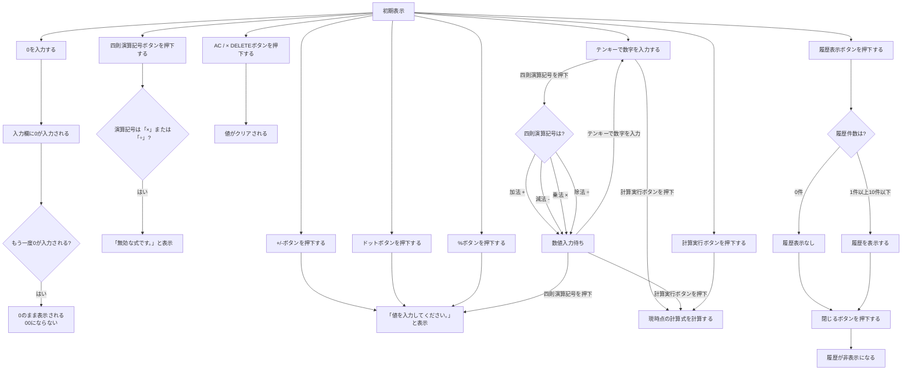

# 基本設計書

## 目次
0. [はじめに](#0-はじめに)  
1. [機能概要](#1-機能概要)  
　1.1 [利用環境](#11-利用環境)  
　1.2 [利用ユーザ/規模](#12-利用ユーザ規模)  
2. [システム概要](#2-システム概要)  
　2.1 [プロジェクト設計](#21-プロジェクト設計)  
3. [標準機能](#3-標準機能)  
4. [画面設計](#4-画面設計)  
5. [詳細](#5-詳細)  
　5.1 [四則演算](#51-四則演算)  
　　5.1.1 [加法](#511-加法)  
　　5.1.2 [減法](#512-減法)  
　　5.1.3 [乗法](#513-乗法)  
　　5.1.4 [除法](#514-除法)  
　5.2 [小数点計算](#52-小数点計算)  
　　5.2.1 [整数で割り切れない値の計算](#521-整数で割り切れない値の計算)  
　5.3 [負数計算](#53-負数計算)  
　　5.3.1 [0以下の数域の計算](#531-0以下の数域の計算)  
　5.4 [百分率計算](#54-百分率計算)  
　5.5 [正負（せいふ）切替機能](#55-正負せいふ切替機能)  
　5.6 [計算履歴](#56-計算履歴)  
  5.7 [削除処理](#57-削除処理)  
　　5.7.1 [値の全削除](#571-値の全削除)  
　　5.7.2 [値の1文字削除](#572-値の1文字削除)  
6. [バリデーションチェック](#6-バリデーションチェック)  
7. [参考資料](#7-参考資料)  

## 0. はじめに
本書では電子式卓上計算機の基本機能、画面のレイアウト設計および入出力設計について記載する。 

 

## 1. 機能概要
### 1.1 利用環境 
　  Google Chromeブラウザ上 

 

### 1.2 利用ユーザ/規模
　  計算機能を電卓で行いたい全世代/1人利用 

 

## 2. システム概要
### 2.1 プロジェクト設計
　  OS： Windows10以上  
　  JAVA： openJDK 17  
　  Webコンテナ： tomcat9  
　  開発ツール： VisualStudioCodeまたはEclipse2025以上 
 
 
 
## 3. 標準機能
| 機能名 | 概要 | 備考 |
|:------------|:------------|:------------|
| 四則演算 | 加法、減法、乗法、除法の計算 | ー |
| 小数点計算 | 整数で割り切れない値の計算 | 「.」（少数）が値に含まれる |
| 負数計算 | 0以下の数域の計算 | 負数は「－」（マイナス）の符号で表す |
| 百分率計算 | 元となる数を百に等しく分けて、その比率を計算 | 「％」（パーセント）の単位で表す |
| 正負（せいふ）切替機能 | 入力した値の符号を切り替える機能 | 「＋」（プラス）と「－」（マイナス） |
| 計算履歴| 入力した計算の履歴を表示する機能 | デフォルトは非表示 |
| 削除機能| 入力されている値を削除する機能 | ACボタンおよび×(Delete)|

 

## 4. 画面設計
画面レイアウトは以下ソースを参照  
jsp-servlet-calculator/calculator.jsp 
jsp-servlet-calculator/UIイメージ.png 
> ※入力値の表示欄はデフォルトは空値

- テンキーパッド
- 計算実行ボタン
- ACボタン
- ×（DELETE）ボタン
- 四則演算記号ボタン
- +/-ボタン
- ドットボタン
- %ボタン
- 履歴表示ボタン

 

## 5. 詳細

### 5.1 四則演算
#### 5.1.1 加法 
　  +記号の左側にある数字または直前の計算結果に右側にある数字を加算する
#### 5.1.2 減法 
　  -記号の左側にある数字または直前の計算結果から右側にある数字を引く
#### 5.1.3 乗法
　  *の左側にある数字または直前の計算結果に右側にある数字をかける
#### 5.1.4 除法
　  ÷の左側にある数字または直前の計算結果を右側にある数字で割る

 
 
### 5.2 小数点計算
#### 5.2.1 整数で割り切れない値の計算
　  画面端まで余りの値を表示する。

 

### 5.3 負数計算
> 負数＋負数は負数の中での加法、負数＋整数は減法
#### 5.3.1 0以下の数域の計算
　  負数としての計算

 
 
### 5.4 百分率計算
> 入力中の数値に対して、百分率（100分の1）への変換、または入力済みの値に対する割合計算を行う。

 
 
### 5.5 正負（せいふ）切替機能
> +/-の切り替え

 
 
### 5.6 計算履歴
> 最大10件の計算履歴の表示

 
 
### 5.7 削除処理
#### 5.7.1 値の全削除
　  ACボタン（オールクリア）を押下し表示されている値全てを削除する
#### 5.7.2 値の1文字削除
　  ×ボタン（Delete）押下し入力されている文字を入力した順番が新しいものから1文字ずつ削除

 

## 6 バリデーションチェック
- ゼロ除算の防止
- 連続する演算子の制御
- 桁数オーバーフローの制限（15桁以内） 
  入力で15桁を上回る場合は、それ以上入力ができない。 
  計算結果が15桁を上回る場合は「Error」表示
- 履歴保持
  最大10件の保持で、ブラウザタブクローズで全ての履歴を削除する 
  計算実行ボタン押下時に最も古い履歴を削除する 
  10件未満の場合は削除処理は実行しない 
  セッションは利用しない

 

## 7 参考資料
- https://www.seplus.jp/dokushuzemi/ec/fe/fenavi/kind_basic_theory/reverse-polish-notation/
- https://saycon.co.jp/archives/neta/reverse_polish_notation
- https://qiita.com/y-some/items/90651c1e27f7798f87c6
